# AI-Powered Inventory Management System

### Snowflake Setup

**What**: Create the backend infrastructure  
**Where**: Snowflake Web UI → Worksheets

First create db and import data following db_setup.sql

**Execute in this order:**

```
1️⃣ snowflake/main_setup.sql (verification script - run Step 1 only to verify data)
   ↓
2️⃣ snowflake/views_heatmap.sql (creates 5 views)
   ↓
3️⃣ snowflake/dynamic_tables.sql (creates 5 auto-refreshing tables)
   ↓
4️⃣ snowflake/streams_tasks.sql (creates automation)
   ↓
5️⃣ 🧠 snowflake/cortex_ai_setup.sql (OPTIONAL: enables AI features)
```

**Expected Results:**

- ✅ 5 Views created (V_STOCK_HEALTH_MATRIX, etc.)
- ✅ 5 Dynamic Tables created (DT_STOCK_HEALTH, etc.)
- ✅ 1 Stream created (INVENTORY_CHANGES_STREAM)
- ✅ 3 Tasks created (TASK_HOURLY_ALERT_CHECK, etc.)
- ✅ 3 New tables (ALERT_HISTORY, REORDER_ACTION_LOG, EXPORT_LOG)

**Verification:**

```sql
SHOW DYNAMIC TABLES;
SELECT COUNT(*) FROM DT_STOCK_HEALTH; -- Should return > 0
```

---

### Dashboard Setup

**What**: Configure and launch the Streamlit dashboard  
**Where**: Your local machine / terminal

**Step 2.1: Create secrets file**

Create file: `streamlit_app/.streamlit/secrets.toml`

```toml
user = "YOUR_USERNAME"
password = "YOUR_PASSWORD"
account = "YOUR_ACCOUNT"  # e.g., "abc12345.us-east-1"
warehouse = "COMPUTE_WH"
database = "inventory_app_db"
schema = "data_schema"
```

**Step 2.2: Install dependencies**

```bash
cd streamlit_app
pip install -r requirements_updated.txt
```

**Step 2.3: Launch dashboard**

```bash
streamlit run app.py
```

**Expected Result:**  
✅ Dashboard opens at http://localhost:8501  
✅ Shows your actual data from Snowflake  
✅ 4 tabs visible: Heatmap, Alerts, Reorder List, Analytics

---

## 📊 Architecture Flow

```mermaid
graph TD
   A[📥 inventory_cleaned] --> B[🔄 INVENTORY_CHANGES_STREAM]
   A --> C[📊 VIEWS Layer]

   C --> D[V_STOCK_HEALTH_MATRIX]
   C --> E[V_ACTIVE_ALERTS]
   C --> F[V_REORDER_RECOMMENDATIONS]
   C --> G[V_LOCATION_PERFORMANCE]
   C --> H[V_CATEGORY_HEATMAP]

   D --> I[DYNAMIC TABLES]
   E --> I
   F --> I
   G --> I
   H --> I

   I --> J[DT_STOCK_HEALTH - 5 min]
   I --> K[DT_ACTIVE_ALERTS - 10 min]
   I --> L[DT_REORDER_RECOMMENDATIONS - 30 min]
   I --> M[DT_LOCATION_PERFORMANCE - 1 hour]
   I --> N[DT_CATEGORY_HEATMAP - 15 min]

   J --> O[⚙️ TASKS]
   K --> O
   L --> O

   O --> P[TASK_HOURLY_ALERT_CHECK]
   O --> Q[TASK_REORDER_RECOMMENDATIONS]

   P --> R[💾 LOGGING TABLES]
   Q --> R

   R --> S[ALERT_HISTORY]
   R --> T[REORDER_ACTION_LOG]
   R --> U[EXPORT_LOG]
```



---

## 🎯 Feature Mapping

| Problem Statement Requirement      | Implementation                                                                                    | Files Involved                                                                           |
| ---------------------------------- | ------------------------------------------------------------------------------------------------- | ---------------------------------------------------------------------------------------- |
| **"Heatmap by location & item"**   | ✅ Interactive Plotly heatmap with Location x Category matrix                                     | `app.py` (lines 250-350)<br>`views_heatmap.sql`                                          |
| **"Early warnings for stockouts"** | ✅ Days-until-stockout calculations<br>✅ Animated alert cards<br>✅ Hourly task generates alerts | `dynamic_tables.sql` (DT_ACTIVE_ALERTS)<br>`streams_tasks.sql` (TASK_HOURLY_ALERT_CHECK) |
| **"Reorder recommendations"**      | ✅ EOQ-based order quantities<br>✅ Priority scoring (1-10)<br>✅ One-click CSV/Excel export      | `dynamic_tables.sql` (DT_REORDER_RECOMMENDATIONS)<br>`app.py` (lines 450-550)            |
| **"Use Dynamic Tables"**           | ✅ 5 dynamic tables with 5min-1hour refresh                                                       | `dynamic_tables.sql`                                                                     |
| **"Use Streams"**                  | ✅ INVENTORY_CHANGES_STREAM for CDC                                                               | `streams_tasks.sql`                                                                      |
| **"Use Tasks"**                    | ✅ 3 tasks (hourly/daily/weekly)                                                                  | `streams_tasks.sql`                                                                      |
| **"Streamlit dashboard"**          | ✅ 4-tab responsive dashboard with animations                                                     | `app.py`                                                                                 |

## ⚡ Quick Command Cheat Sheet

### Snowflake Commands

```sql
-- Check data exists
SELECT COUNT(*) FROM inventory_cleaned;

-- Check dynamic tables
SHOW DYNAMIC TABLES;
SELECT COUNT(*) FROM DT_STOCK_HEALTH;

-- Manually refresh if needed
ALTER DYNAMIC TABLE DT_STOCK_HEALTH REFRESH;

-- Check tasks
SHOW TASKS;

-- Activate tasks (optional)
ALTER TASK TASK_HOURLY_ALERT_CHECK RESUME;
```

### Terminal Commands

```bash
# Setup
cd streamlit_app
pip install -r requirements_updated.txt

# Run dashboard
streamlit run app.py

# Stop dashboard
Ctrl+C
```

---

## 📞 Quick Help

**Issue**: Dynamic tables have no data  
**Fix**: `ALTER DYNAMIC TABLE DT_STOCK_HEALTH REFRESH;`

**Issue**: Dashboard shows "No Snowflake connection"  
**Fix**: Check `.streamlit/secrets.toml` credentials

**Issue**: Slow dashboard loading  
**Fix**: Add filters to reduce data volume

**Issue**: Tasks not running  
**Fix**: `ALTER TASK TASK_HOURLY_ALERT_CHECK RESUME;`
